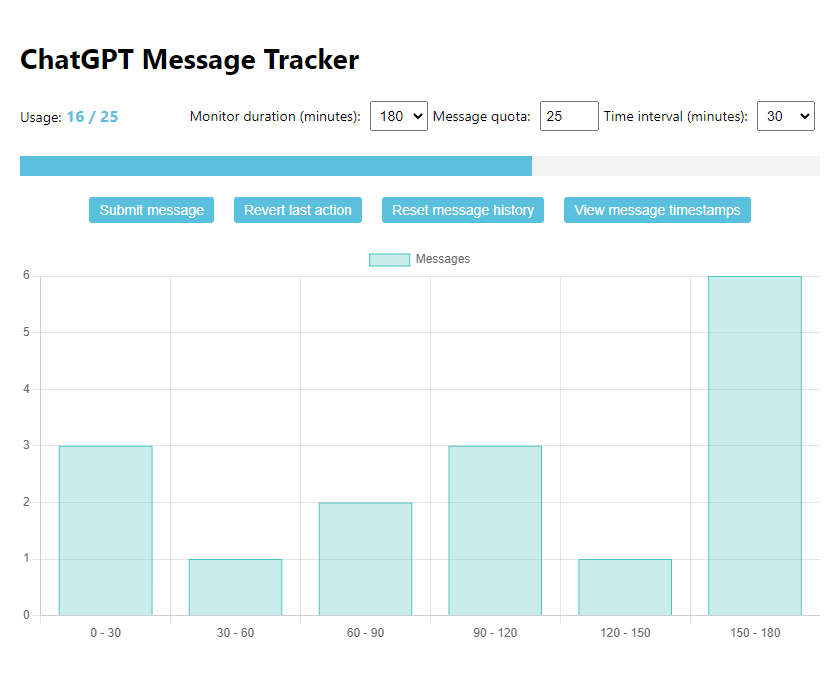

# ChatGPT Message Tracker

A simple HTML tool for OpenAI's ChatGPT users to easily track and manage their messages when using the GPT-4 model. This tool is designed specifically for GPT-4 due to its message cap.

## Why is this useful for ChatGPT users?

When using the GPT-4 model, there's a limit on the number of messages in a conversation. Keeping track of messages and ensuring you don't exceed this limit can be cumbersome. This tool simplifies the process by helping you monitor the number of messages and automatically managing them within the limit.

## Usage

1. Open `chatgpt-message-tracker.html` in your web browser.
2. Send a message to ChatGPT using your preferred method.
3. Click the "Submit message" button in the ChatGPT Message Tracker to record your message.
4. The tool will track your messages and manage them within the message cap.

*Note: This tool is specifically designed for the GPT-4 model and is not intended for use with the Default(GPT3.5) or Legacy(GPT3.5) models, as they do not have a message cap.*

**Fun fact**: This handy HTML tool and this README were both created with the assistance of ChatGPT, showcasing the productivity benefits of AI.
